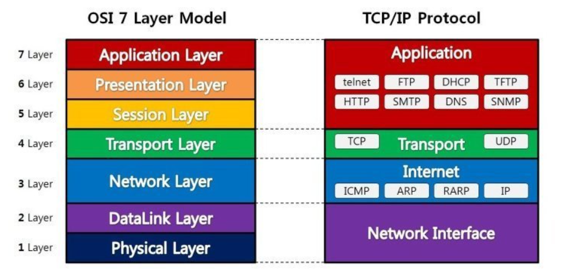

# 컴퓨터 네트워크 

# 1. OSI 7계층? 

> ## 7가지 계층으로 나눌 수 있다. 
> 1. 물리계층 
  - 단위 : 시그널 (신호,Bit)
  - 사용하는 장비 : Hub(입력신호를 복제해서 출력할 때),Repeater(전송 시스템 수를 늘리거나 전송 거리를 연장하고자 할 때 사용)
> 2. 데이터링크 계층 
  - 사용하는 장비 : Bridge(네트워크와 네트워크를 연결해주는 장비),Switch(여러 개의 호스트를 연결해주는 역할을 한다.)
  - 단위 : 프레임 
> 3. 네트워크 계층
  - 사용하는 장비: 라우터(네트워크와 네트워크를 연결해주는 장비로 , 목적지 네트워크까지 연결해주는 역할을 한다.)
  - 단위 : 패킷
  - 사용하는 프로토콜 : - IP,IPSec(IP계층 보호),Internet Control Message Protocol(패킷 처리시 발생되는 문제 알려줌)
> 4. 전송 계층 
  - 사용하는 장비: 방화벽(비 인가된 접근에 대한 차단)
  - 단위 : 세그먼트
  - 사용하는 프로토콜 : TCP,UDP 프로토콜 사용
> 5. 세션 계층 
> 6. 표현 계층 - JPEG,MPEG
> 7. 응용 계층 - HTTP(Hyper Text Transfer Protocol),SMTP,FTP

# 2. TCP/IP , UDP 란?
> 1. Transmission Control Protocol (TCP)
- TCP는 전송계층(4계층)에 포함되어서 신뢰성 있는 통신과 흐름제어 , 혼잡제어 같은 기능을 제공하는 프로토콜이다.
- TCP / IP 에서는 통신을 할 때 패킷형태로 주고 받는다.   
> 2. Internet Protocol (IP)
- 인터넷 프로토콜(Internet Protocol)의 약자로 흔히는 이 프로토콜에서 각 장치를 나타내는 IP 주소를 가리키는 말로 쓰인다.각 장치들의 전화번호라고 생각하면 쉽다.(출처 나무위키)
- 네트워크 계층(3계층)에 포함되어 있다.
- IP는 IPv4와 IPv6로 나뉘며 , IPv4의 주소 고갈에 대비하기 위해서 IPv6가 생겨났다.
- IPv4 - 32비트 , IPv6 - 128비트 제공

### IPv4의 서브네팅 

    서브네팅은 32비트에서 앞에 24비트는 A클래스 B클래스 C클래스에 관한 내용이고 , 
    뒤에 나머지 8비트는 호스트의 주소에 할당한다는 내용이다.
    
    즉 192.58.65.0/24 를 2개의 네트워크로 나눠라 라고 하면 , 뒤에 붙은 /24가 24비트 즉 C클래스를
    의미하는 것이고 , 그리고 2개의 네트워크로 나눠야 하기 때문에 , 
    
    앞에 24비트에다가 뒤에 1비트를 하나더 끌어다 쓰면 25가 된다.
     (1bit가 2개의 값을 갖기 때문에 2개의 네트워크로 나눌 수 있다.)
    
    그래서 192.58.65.0/25 가 되고 , 뒤에 호스트 8Bit 중에서 1개를 끌어다 썼고
    8개의 비트 중 끌어다 사용한 1개 비트 자릿수를 구해주면
    
    192.58.65.0/25 
    192.58.65.128/25 
    
    이렇게 두개가 나온다는 것을 알 수 있다.

> 3. User Datagram Protocol (UDP)
- TCP와는 다르게 흐름제어나 혼잡제어 ,신뢰성 있는 통신을 제공하지 않는다 . 
- UDP는 TCP와는 달리, 메시지를 패킷(데이터그램)으로 나누고, 반대편에서 재조립하는 등의 서비스는 제공하지 않으며, 특히 도착하는 데이터 패킷들의 순서를 제공하지 않는다.
- 대신에 빠른 연결 및 통신을 요구하는 곳에 사용된다.

# 3. 응용 계층 (HTTP,SMTP,FTP)

     1.응용계층에는 문서를 전송하는 HTTP, 메일을 전송하는 SMTP , 파일을 전송하는 FTP 프로토콜이 존재한다.
        - HTTP는 StateLess 방식을 사용한다, 정보에 대한 작업을 하고 연결을 끊어버리는 방식을 사용해서 서버의 부담을 줄인다.
        - 반면에 채팅은 연결이 계속 되어 있는 StateFul 방식을 사용한다.
        - 하지만 HTTP에서 연결이 계속 되어 있는 것을 증명해야 한다.

 
## SOAP와 REST

    - SOAP와 REST는 모두 데이터 전송 방식에 대한 규약이다.
    - SOAP는 WWW에서 공식적으로 유지보수하는 프로토콜이지만 REST는 API를 설계하는 원칙일 뿐이다.
    # SOAP의 특징 
    - SOAP는 다른 언어와 다른 플랫폼에서 빌드된 어플리케이션이 서로 통신할 수 있도록 만든
    최초의 표준 프로토콜이다.
    - SOAP는 HTTP,SMTP,TCP 등 다양한 요청을 처리할 수 있으며 
    요청을 받으면 XML 형식으로 리턴값을 넘겨준다.

## 네트워크 토폴로지 
    
    - 네트워크의 링크와 노드를 연결한 모습을 나타내는것

    - 버스형 : 중앙 제어 노드에 모든 장치를 연결한 모습 , 구축 비용이 저렴함
    - 링형 : 원을 두른 형태로 인접 노드가 연결되어 있다. 
    - 성형 : 링형과 유사한 형태이지만 모든 노드가 연결되어 있다. 
    - 트리형 : 최상단에 제어 노드가 있고 , 이를 토대로 
    - 그물형 : 중앙 제어 노드 없이 모든 노드가 서로 1:1로 연결되는 형태 , 가장 복잡하고 구축 비용이 많이 들어가지만 가장 안전함

## 네트워크 통신방식 
    
    - Unicast : 통신하고자 하는 대상과 직접 메시지를 보내는 방식
    - Broadcast : 네트워크의 모든 호스트들에게 
    - Multicast : 특정 그룹의 호스트들에게 메시지를 보내는 방식 (수신자가 정해져 있음)

## HTTP와 HTTPS

    - HTTP는 전송 계층 위에서 작동하며 서버 간의 통신에서 별다른 보안조치가 없기 때문에
    네트워크 신호를 가로챈다면 , HTTP의 내용이 외부에 노출되게 된다.
    그래서 여기에 SSL(Secure Sockets Layer)이라는 보안계층을 전송계층 위에 얹어서 
    보안이 보장된 통신을 하는 프로토콜을 HTTPS라고 합니다.
    SSL은 공개키 암호화 방식을 사용합니다.

